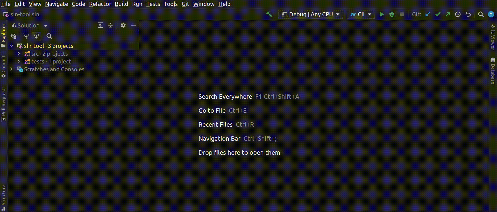

# sln-tool

**sln-tool** is a .NET tool that allows you to add and remove files in your solution.

I use [JetBrains Rider](https://www.jetbrains.com/rider) and couldn't find a way
to create **Solution Items** folder that contains files like _.editorconfig_ or _.gitignore_ so I made this.

Here it is in action:



## Installation

Installation is available via [NuGet](https://www.nuget.org/packages/sln-tool). You need .NET 5 to use this tool.

Run this command:

```
dotnet tool install --global sln-tool
```

After successfull installation **sln-tool** should be in your path.

## Usage

You need to run this tool in the same folder as your solution file.

### Adding|Removing files

```
sln-tool add|remove [-f|--sln-folder] [-n|--sln-name] <files>
```

| Argument   | Description                            | Default                              |
| ---------- | -------------------------------------- | ------------------------------------ |
| sln-folder | Container that holds files or projects | Solution Items                       |
| sln-name   | Name of your solution file             | First found file with .sln extension |
| files      | List of files to add or remove         | Empty                                |

You can list multiple files. Duplicates will be skipped.

If the file you want to add is inside a folder, write it like this:

```
sln-tool add .github/workflows/ci.yml
```

### Listing solution folders

```
sln-tool list [-n|--sln-name]
```

| Argument | Description                | Default                              |
| -------- | -------------------------- | ------------------------------------ |
| sln-name | Name of your solution file | First found file with .sln extension |

### Examples

You can see usage examples with:

```
sln-tool examples
```

### Help

If you still have questions, try:

```
sln-tool --help
sln-tool <verb> --help
```

## License

Distributed under the MIT License. See [LICENSE](LICENSE) for more information.

## Contributing

If you find a bug or anything feels off, feel free to submit an issue or pull request.

Any contributions are greatly appreciated.
